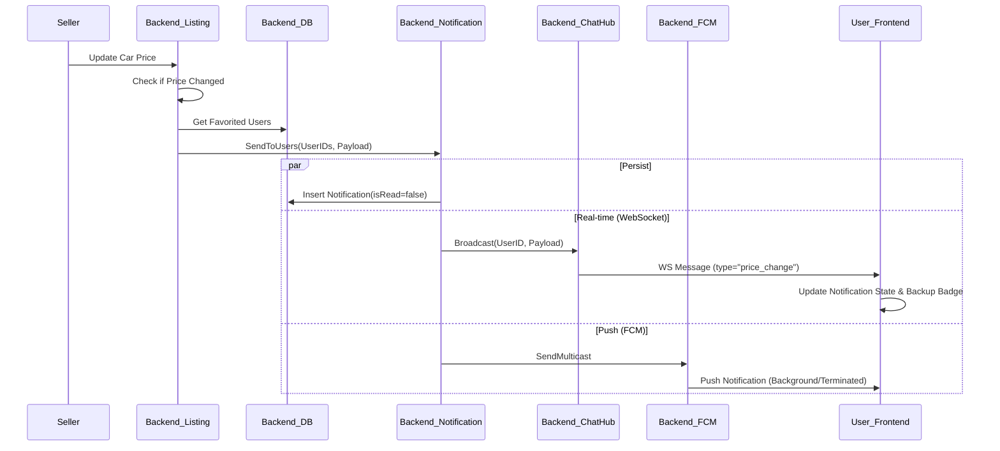

# Implementation Plan - Real-time Price Change Notifications

## Goal Description
Implement a complete notification system where users receive real-time alerts when the price of a favorited car changes.
- **Trigger**: Seller updates car price.
- **Delivery**: WebSocket (real-time in-app) + FCM (background/offline).
- **UI**: Notification list, unread badge, click navigation.

## User Review Required
> [!IMPORTANT]
> **Database Schema**: The `notifications` table is defined in migration `010` but was missing from the main [init_full_database.sql](file:///c:/Users/Nahid/Desktop/Programming/turbocar/car-reselling-backend/init_full_database.sql). I will ensure it exists.
>
> **Architecture Change**: I will inject a `WebSocketBroadcaster` interface into the `notification` service to allow it to push real-time updates via the existing `chat` WebSocket connection, avoiding circular dependencies.

## Proposed Changes

### Backend

#### [MODIFY] [internal/notification/service.go](file:///c:/Users/Nahid/Desktop/Programming/turbocar/car-reselling-backend/internal/notification/service.go)
- Define `WebSocketBroadcaster` interface inside `notification` package.
- Add `wsBroadcaster` field to [Service](file:///c:/Users/Nahid/Desktop/Programming/turbocar/car-reselling-backend/internal/notification/service.go#18-22) struct.
- update [SendToUsers](file:///c:/Users/Nahid/Desktop/Programming/turbocar/car-reselling-backend/internal/listing/service.go#19-20) method to:
    - Persist to DB (logic exists).
    - Send via WebSocket (NEW: if broadcaster is set).
    - Send via FCM (logic exists).

#### [MODIFY] [internal/chat/hub.go](file:///c:/Users/Nahid/Desktop/Programming/turbocar/car-reselling-backend/internal/chat/hub.go)
- Implement `SendNotification(userID uuid.UUID, notification Notification)` method (or similar) that matches `WebSocketBroadcaster` interface.
- This method will look up the user's connection and send a JSON payload with `type: "notification"` or `type: "price_change"`.

#### [MODIFY] [internal/chat/service.go](file:///c:/Users/Nahid/Desktop/Programming/turbocar/car-reselling-backend/internal/chat/service.go)
- Expose the Hub's sending capability so it can be passed to the notification service.

#### [MODIFY] [cmd/api/main.go](file:///c:/Users/Nahid/Desktop/Programming/turbocar/car-reselling-backend/cmd/api/main.go)
- Wire up the dependency: Pass `chatService` (implementing the interface) to `notificationService`.

### Frontend

#### [MODIFY] [lib/presentation/providers/notification_provider.dart](file:///c:/Users/Nahid/Desktop/Programming/turbocar/turbo_car/lib/presentation/providers/notification_provider.dart)
- Update [NotificationListNotifier](file:///c:/Users/Nahid/Desktop/Programming/turbocar/turbo_car/lib/presentation/providers/notification_provider.dart#51-139) to listen to [SocketService](file:///c:/Users/Nahid/Desktop/Programming/turbocar/turbo_car/lib/data/services/socket_service.dart#17-199).
- When a message with `type: "price_change"` arrives:
    1.  Parse it into `NotificationModel`.
    2.  Call [addNotification(model)](file:///c:/Users/Nahid/Desktop/Programming/turbocar/turbo_car/lib/presentation/providers/notification_provider.dart#94-102) to update state.
    3.  Trigger local notification (using [NotificationService](file:///c:/Users/Nahid/Desktop/Programming/turbocar/turbo_car/lib/core/services/notification_service.dart#21-349)) if the user is not currently *on* the notification page (optional, user asked for "dot badge" when elsewhere, real-time list update when on page).

#### [MODIFY] [lib/presentation/pages/notification/notification_page.dart](file:///c:/Users/Nahid/Desktop/Programming/turbocar/turbo_car/lib/presentation/pages/notification/notification_page.dart)
- Ensure the list updates automatically (Riverpod stream/state should handle this).
- Implement "silently refresh" logic (Riverpod state update does this naturally without full page reload).

#### [MODIFY] [lib/data/services/socket_service.dart](file:///c:/Users/Nahid/Desktop/Programming/turbocar/turbo_car/lib/data/services/socket_service.dart)
- Ensure `WSMessage` handling supports notification payloads (or generic JSON maps).
- Currently `WSMessage` might be strict. I need to check [lib/data/models/message_model.dart](file:///c:/Users/Nahid/Desktop/Programming/turbocar/turbo_car/lib/data/models/message_model.dart).
    - *Action*: I'll check `message_model.dart` during execution. If strict, I'll relax it or add a helper.

## Data Flow Charts

### Price Change Update Flow

## Verification Plan

### Automated Tests
- **Backend Unit Tests**:
    - Test `notification.Service.SendToUsers` mocks `wsBroadcaster` and verifies it is called.
- **Frontend Logic**:
    - Verify [NotificationListNotifier](file:///c:/Users/Nahid/Desktop/Programming/turbocar/turbo_car/lib/presentation/providers/notification_provider.dart#51-139) correctly adds items when fed a mock socket event.

### Manual Verification
1.  **Setup**:
    - User A (Seller) logs in on Device 1.
    - User B (Buyer) logs in on Device 2 (or Simulator).
2.  **Preparation**:
    - User B favorites a car listed by User A.
    - User B goes to Home Screen (observe notification icon).
3.  **Trigger**:
    - User A updates the price of that car.
4.  **Verify Real-time (In-App)**:
    - User B should see a red dot/badge appear on the notification icon immediately (WebSocket).
    - User B opens Notification Page.
    - The new notification should be at the top.
    - Click notification -> Navigate to Car Details.
5.  **Verify Background (FCM)**:
    - User B puts app in background.
    - User A changes price again.
    - User B should receive a system push notification.
    - Click notification -> Open App -> Open Notification Page.
